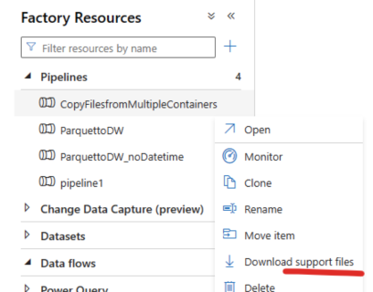

# Repository setup

## Git integration

To be able to write tests for data factory, the pipeline and activity definitions need to be available. The recommended way to do this is to sync the Data Factory instance to a git repository, so that a `tests` folder can be created in the same repository and write tests for your data factory. The git integration process can be found here:

1. [Fabric - Git integration process](https://learn.microsoft.com/fabric/cicd/git-integration/git-integration-process)
2. [Azure Data Factory - Git integration process](https://learn.microsoft.com/azure/data-factory/source-control)

### Alternative for Azure Data Factory

To download a single JSON file for testing purposes,  follow these steps:

1. Open the Data Factory instance, and open the pipeline to be tested.
2. Click on the action ellipses
3. Click "Download support files"
4. Extract the zip file containing the pipeline definition in a folder of choice.

> Remember the location of this folder, as it will be needed to initialize the framework.

Once the repository is set up, the framework can be installed and initialized as described in the [installing and initializing the framework](installing_and_initializing_framework.md) page.
