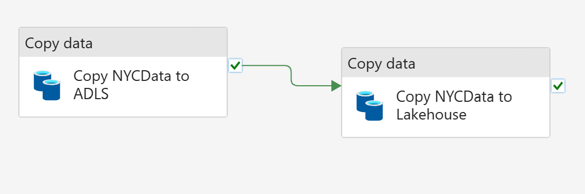

# Nested pipelines

The goal of the pipeline is to iterate through a configuration json file and for each iteration item verify if the combination of the year/month data to be ingested is new or have been updated in the source system. If that is the case then a nested pipeline is invoked and will be responsible to execute the ingestion in 2 steps:

- from the web to an adlsgen2 container
- from the adlsgen2 container to the Fabric lakehouse

If the data is already in the lakehouse and has not been updated, the ingestion pipeline is not triggered.


The main pipeline is composed of 2 top activities:

- a Lookup activity named "Read Configuration File"
- a ForEach activity named "ForEachYearMonthPair"

Within the ForEach activity, there is a nested If activity called "If New Or Updated" and if this activity evaluates to `True`, the  "Invoke Ingestion Pipeline" activity is triggered.

The Ingestion pipeline is composed also by two activities:

- a Copy activity named "Copy NYCData to ADLS" that copies from the Web to an ADLS Gen2 storage,
- a Copy activity named "Copy NYCData to Lakehouse" that copies from the ADLS Gen2 storage to the Lakehouse.

Additionally the ingestion pipeline expects to receive two parameters when invoked: dynamicMonth and dynamicYear.
These parameters are dynamically passed from the pair month and year that is running in the current iteration of the ForEach loop.



## Testing the pl_main activities

The file that contains the individual activity tests for the pl_main_pipeline is located [here](./fabric/tests/test_pl_main_activity.py) and it contains four individual activity tests:

- test_activity_read_configuration_file, which is responsible to test if the json configuration file is correctly located and defined.
- test_activity_if_true, responsible to check if the boolean result of the condition evaluates to `True`. If so, the pipeline can proceed with the ingestion of new or updated data by triggering the "pl_ingestion" pipeline.
- test_activity_if_false, responsible to check if the boolean result of the condition evaluates to `False`. If so, the pipeline can proceed to next item in the ForEach Loop.
- test_activity_invoke_pipeline, responsible to check if the nested pipeline is correctly invoked.

## Testing the pl_ingestion activities

The file that contains the individual activity tests for the pl_ingestion_pipeline is located [here](./fabric/tests/test_pl_ingestion_activity.py) and it contains two individual activity test:

- test_copy_nyc_data_from_web_to_adls2, this test is responsible to test both source (web) and target (adlsgen2) paths expressions to ensure that the paths are well formed and within the correct stablished partition norms.
- test_copy_nyc_data_from_adls2_to_lakehouse, similar to the previous one but the previous target is now the source (adls2) and the current target is the Fabric Lakehouse.

## Testing the pl_main pipeline with should_evaluate_child_pipelines=True

The framework provides the possibility to test nested pipelines out-of-the-box through the use of the following flag: should_evaluate_child_pipelines.

Setting the should_evaluate_child_pipelines flag to `True`, means that the test is being done on the main pipeline jointly with the child(s) pipeline(s). For more details check the code below:
below:

```python
@pytest.fixture
def test_framework(request: pytest.FixtureRequest) -> TestFramework:
    return TestFramework(
        framework_type=TestFrameworkType.Fabric,
        root_folder_path=os.path.join(Path(request.fspath.dirname).parent),
        should_evaluate_child_pipelines=True,
    )
```

The full example is available [here](./fabric/tests/test_pl_main_pipeline_child_flag_true.py).

In this specific case you can test for the number of activities within the pipeline and respective types for example. Furthermore, you can do similar tests to the ones were done on the individual activity tests.

For this particular pipeline, we will have three activities to evaluate, the first one belongs to the pl_main pipeline and the second and third ones belong to the pl_ingestion pipeline:

- read_configuration_file_activity = next(activities)
- copy_nyc_data_to_adls_pipeline_activity = next(activities)
- copy_nyc_data_to_lakehouse_pipeline_activity = next(activities)

## Testing the pl_main pipeline with should_evaluate_child_pipelines=False

Setting this flag to `False`,  means that the test is just being done on the main pipeline and the child pipeline will not be loaded for evaluation. For more details check the code below:

```python
@pytest.fixture
def test_framework(request: pytest.FixtureRequest) -> TestFramework:
    return TestFramework(
        framework_type=TestFrameworkType.Fabric,
        root_folder_path=os.path.join(Path(request.fspath.dirname).parent),
        should_evaluate_child_pipelines=False,
    )
```

The full example is available [here](./fabric/tests/test_pl_main_pipeline_child_flag_false.py).

In this specific case you can test for the number of activities within the pipeline and respective types for example. Furthermore, you can do similar tests to the ones were done on the individual activity tests.

For this particular pipeline, we will have two activities to evaluate:

- read_configuration_file_activity = next(activities)
- invoke_ingestion_pipeline_activity =  next(activities)

For the control activities, If and ForEach in this specific pipeline, the framework does the evaluation in the background so they won't be available when running the next(activities) function.

## Additional Notes

Be aware that when using the previous json files on your environment, the connection IDs should be adjusted:

```json
              "externalReferences": {
                "connection": "a97f9477-e2b0-4a61-bc57-081255466130"
              }
```

In this specific example three connections are should be created upfront and referenced in the json definition files:

- the connection to the Web where the Taxi Data is being pulled from
- connection to the ADLSGen2 storage account
- connection to the Fabric Lakehouse
